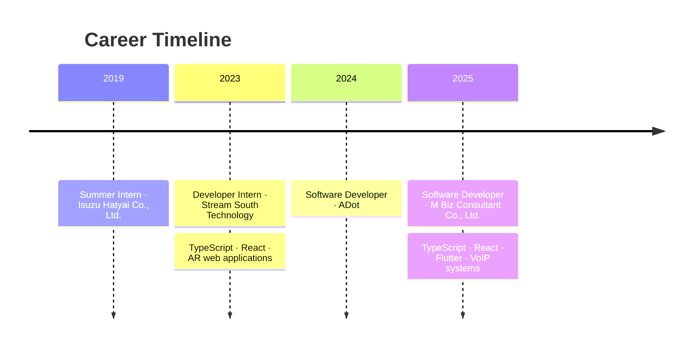
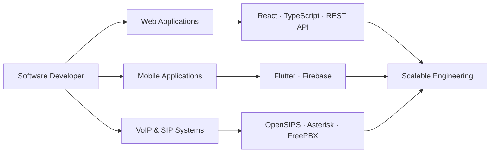

# Wuttichai Sukantho

<!-- markdownlint-disable MD033 -->

<pre>
██╗    ██╗██╗   ██╗████████╗████████╗██╗ ██████╗██╗  ██╗ █████╗ ██╗
██║    ██║██║   ██║╚══██╔══╝╚══██╔══╝██║██╔════╝██║  ██║██╔══██╗██║
██║ █╗ ██║██║   ██║   ██║      ██║   ██║██║     ███████║███████║██║
██║███╗██║██║   ██║   ██║      ██║   ██║██║     ██╔══██║██╔══██║██║
╚███╔███╔╝╚██████╔╝   ██║      ██║   ██║╚██████╗██║  ██║██║  ██║██║
 ╚══╝╚══╝  ╚═════╝    ╚═╝      ╚═╝   ╚═╝ ╚═════╝╚═╝  ╚═╝╚═╝  ╚═╝╚═╝
</pre>

Software Developer · Backend Engineer

📍 Hat Yai, Songkhla, Thailand

Designing maintainable backend systems with a focus on performance, security, and clear architecture.

  <a href="https://github.com/WuttichaiSukantho">GitHub</a>
  ·
  <a href="https://wuttichai-web-41c80.firebaseapp.com/">Live Demo</a>

  
  
  
  
  
  

<a href="#about">About</a> ·
<a href="#professional-experience">Experience</a> ·
<a href="#education">Education</a> ·
<a href="#portfolio">Portfolio</a> ·
<a href="#technology-areas">Stack</a> ·
<a href="#github-activity">Activity</a> ·
<a href="#connect">Connect</a>

## 👋 About

I focus on backend services and REST APIs with TypeScript and modern web tooling. My interests include modular design, domain separation, reliable authentication, and the operational details that help systems remain understandable as they grow.

This profile repository is a concise overview of my engineering focus. Project-specific implementation details belong in the repositories where the code lives.

<table width="100%">
  <tr>
    <td align="center"><strong>👨‍💻 Role</strong> Software Developer</td>
    <td align="center"><strong>🏢 Current</strong> M Biz Consultant</td>
    <td align="center"><strong>⚡ Core</strong> TypeScript · React</td>
    <td align="center"><strong>🌐 Portfolio</strong> <a href="https://wuttichai-web-41c80.firebaseapp.com/">View live</a></td>
  </tr>
</table>

## 📌 Current Direction

- Building scalable and maintainable backend systems
- Improving performance and operational reliability
- Strengthening secure API design
- Shipping software with a production mindset

## 🧭 Engineering Focus

- Production-oriented REST API design
- Modular, object-oriented architecture and domain separation
- Authentication flows using JWT, including registration, login, and refresh tokens
- OpenAPI-driven API documentation
- Performance work such as rate limiting, compression, and caching
- Environment validation and secure middleware design
- Containerized development and deployment workflows

## 🧑‍💻 Professional Experience

<table width="100%">
  <tr>
    <td width="25%"><strong>Jan 2025 – Present</strong> Full-time Thailand · On-site</td>
    <td><strong>Software Developer</strong> <strong>M Biz Consultant Co., Ltd.</strong>  Developing web applications with TypeScript and React, mobile applications with Flutter, and VoIP infrastructure using OpenSIPS, Asterisk, and FreePBX. Work includes WebSocket communication, Firebase Push Notifications, SIP-based communication solutions, dynamic registration, call routing, and server-performance optimization.</td>
  </tr>
  <tr>
    <td><strong>May 2024 – Dec 2024</strong> Full-time Thailand · On-site</td>
    <td><strong>Software Developer</strong> <strong>ADot</strong></td>
  </tr>
  <tr>
    <td><strong>Jul 2023 – Oct 2023</strong> Internship Hat Yai, Songkhla, Thailand</td>
    <td><strong>Developer</strong> <strong>Stream South Technology</strong>  Worked on TypeScript and React web development, including AR (Augmented Reality) web applications for the <a href="https://nimitr.art/">nimitr.art</a> project.</td>
  </tr>
  <tr>
    <td><strong>Mar 2019 – May 2019</strong> Internship Hat Yai District, Songkhla, Thailand</td>
    <td><strong>Summer Intern</strong> <strong>Isuzu Hatyai Co., Ltd.</strong></td>
  </tr>
</table>

## 🎓 Education

<table width="100%">
  <tr>
    <td width="25%"><strong>Jul 2020 – May 2023</strong> Grade: 3.68</td>
    <td><strong>Bachelor of Business Administration</strong> Business Information System <strong>Rajamangala University of Technology Srivijaya</strong></td>
  </tr>
  <tr>
    <td><strong>2016 – 2020</strong></td>
    <td><strong>Vocational Certificate</strong> Business Computer <strong>Amnuaywit Hatyai Technology College</strong></td>
  </tr>
  <tr>
    <td><strong>2014 – 2016</strong></td>
    <td><strong>Junior High School</strong> Science-Math Ability <strong>Hatyai Wittayalai Somboonkulkanya School</strong></td>
  </tr>
  <tr>
    <td><strong>2005 – 2014</strong></td>
    <td><strong>Sahasart Wittayakarn School</strong></td>
  </tr>
</table>

## 🚀 Portfolio

### Personal Portfolio

Explore my interactive portfolio: [wuttichai-web-41c80.firebaseapp.com](https://wuttichai-web-41c80.firebaseapp.com/)

The portfolio presents my background as a software developer, with a focus on backend development, system architecture, API engineering, education, and technical skills.

#### ✨ Portfolio Highlights

- Interactive sections for Home, Playground, About, Story, Experience, Education, and Contact
- Responsive sticky navigation with desktop and mobile layouts
- English/Thai language switcher and theme controls
- Animated page-load and section transitions with interactive hover states
- Education and career timeline, including software engineering and information technology milestones
- Public links to GitHub, LinkedIn, JobsDB, and other social profiles

#### 🧱 Portfolio Stack

The portfolio is built with **React**, **Vite**, **TypeScript**, and **Firebase**, with a dark visual system, responsive layouts, decorative motion, and structured metadata for sharing and search engines.

#### 💼 Professional Profile

The portfolio identifies my current professional role at **M BIZ CONSULTANT CO., LTD.** and documents my development path from foundational education through vocational computer information studies and university-level information technology and software engineering.

## 🧰 Technology Areas

  <strong>Web & API</strong> 
  
  
  
  
  

  <strong>Backend & Runtime</strong> 
  
  
  
  
  

  <strong>Data & Cloud</strong> 
  
  
  
  
  

  <strong>Mobile, VoIP & Delivery</strong> 
  
  
  
  
  

| Area                  | Tools and technologies                                  |
| --------------------- | ------------------------------------------------------- |
| Web development       | TypeScript · React · Vite · Firebase                    |
| Mobile development    | Flutter                                                 |
| Backend and APIs      | Node.js · Bun · Elysia · Express.js · REST API          |
| Languages             | TypeScript · JavaScript                                 |
| Data and messaging    | PostgreSQL · MongoDB · Prisma ORM · Redis · WebSocket   |
| VoIP and telephony    | SIP · OpenSIPS · Asterisk · FreePBX                     |
| Tools and delivery    | GitHub · CI/CD · Docker · containerized workflows       |
| Engineering practices | Modular design · domain separation · clean architecture |

## 🗺️ Developer Profile

<table width="100%">
  <tr>
    <td align="center" width="25%"><strong>🌐 Web</strong> React · TypeScript REST API</td>
    <td align="center" width="25%"><strong>📱 Mobile</strong> Flutter Firebase</td>
    <td align="center" width="25%"><strong>☎️ VoIP</strong> SIP · OpenSIPS Asterisk</td>
    <td align="center" width="25%"><strong>⚙️ Delivery</strong> GitHub · CI/CD Docker</td>
  </tr>
</table>

🏗️ Architectural principles

I value small, well-defined modules, explicit boundaries between domains, and designs that keep business logic testable and independent from infrastructure concerns. I use patterns such as island-style modular organization and class-grouped objects when they improve cohesion and maintainability.

## 📊 GitHub Activity

 

 

 

## 🤝 Connect

Explore my work and professional background through:

- [Portfolio](https://wuttichai-web-41c80.firebaseapp.com/)
- [GitHub](https://github.com/WuttichaiSukantho)
- [LinkedIn](https://www.linkedin.com/in/wuttichai-sukantho-0939b1241/)
- [JobsDB profile](https://th.jobsdb.com/profiles/%E0%B8%A7%E0%B8%B8%E0%B8%92%E0%B8%B4%E0%B8%8A%E0%B8%B1%E0%B8%A2-%E0%B8%AA%E0%B8%B8%E0%B8%84%E0%B8%B1%E0%B8%99%E0%B9%82%E0%B8%91-2vytXlpx0N)

_Performance is a feature. Security is a baseline. Scalability is intentional._

